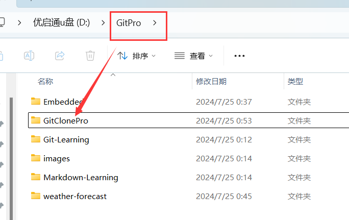
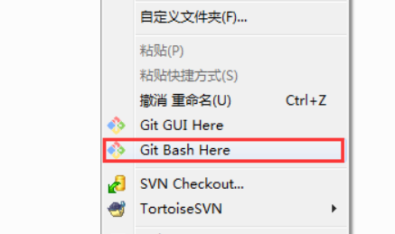
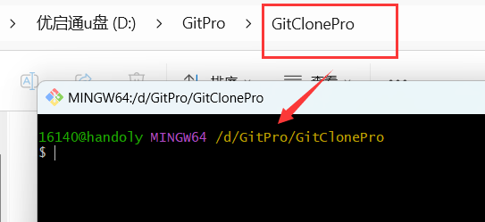

# Git 学习

## 一、说明

本仓库是本人主要用来存放学习git的一些命令以及心得。

本仓库的`README.md`文件更改后简易的提交代码：(直接复制粘贴到`Git Bash`命令行即可)

```bash
git add "README.md"
git commit -m "修改内容"
git branch -M main
git push -u origin main
```


## 二、项目上传

[^注释]: 将项目上传到`github`的主要操作流程

1. 在`github`新建仓库，记住不要勾选`添加README.md文件`的选项

2. 在本地新建一个文件夹

3. 将项目文件放入该文件夹

4. 打开Git Bash软件，在命令行输入 `cd` 命令，进入该文件夹

5. 初始化仓库：`git init` 

6. 添加内容到**暂存区**：`git add "文件/文件夹名"`

7. 将暂存区内容添加到本地仓库：`git commit -m "备注信息"`

8. 将当前分支（默认分支：master）强制重命名为`main` 分支

   -  `git branch -M main`

     - `-M` 表示强制重命名
       - `m`是move的缩写
       - `M`是强制版本

     - 若`main`已经存在，则先删除现有的 `main` 分支，再进行重命名操作。如果只使用 `-m` 选项，Git 会报错提示目标分支已存在。

9. 将一个远程仓库添加到本地 Git 仓库

   - `git remote add origin git@github.com:用户名/仓库名.git` 
     - `git remote add`：这是用于添加远程仓库的 Git 命令。你可以在本地仓库中添加一个或多个远程仓库，以便与它们进行交互。
     - `origin`：这是你给远程仓库起的一个名字，通常默认使用 `origin` 这个名字。你也可以使用其他名字，但 `origin` 是一个惯例，表示默认的远程仓库。

10. 将本地 `main` 分支的内容推送到远程仓库，并设置跟踪关系

    - `git push -u origin main`
      - `git push`：这是将本地提交的更改推送到远程仓库的命令。
      - `-u` 或 `--set-upstream`：这个选项设置本地分支和远程分支之间的跟踪关系。这样，以后在执行 `git pull` 或 `git push` 时，不需要再指定远程分支的名称。
      - `origin`：这是远程仓库的名称，在你之前使用 `git remote add origin <URL>` 时指定的名字。
      - `main`：这是你要推送的本地分支的名称。

## 三、示例

[^注释]: 上传`README.md`文件

从第5步开始演示：

```bash
git init
git add README.md
git commit -m "first commit"
git branch -M main
git remote add origin git@github.com:Handoly/Git-Learnng.git
git push -u origin main
```

## 四、常见错误

- `error: failed to push some refs to 'github.com:Handoly/weather-forecast.git'`

  ​	在发送`git push -u origin main`后出现这个错误，有可能是因为在github远程仓库进行了操作（如上传文件等），从而导致远程仓库发生了变化而本地仓库却没有更新，导致仓库不匹配，此时应该先将远程仓库拉取到本地仓库进行更新，再进行推送。操作如下：

  - `git pull origin main` 

- `error: remote origin already exists.`

  ​	在发送`git remote add origin git@github.com:Handoly/Git-Learning.git`命令后出现这个错误，说明远程仓库`origin`已经存在，可通过以下选项解决：

  - 选项1：如果你是第一次发送这个命令则看选项2-4，如果不是第一次发送，则可以选择不发送这个命令，直接将本地项目添加到远程仓库：`git push -u origin main`

  - 选项2：查看现有远程仓库：`git remote -v`

  - 选项3：修改现有远程仓库的URL：`git remote set-url origin git@github.com:Handoly/Git-Learning.git` 

  - 选项4：删除现有的远程仓库并重新添加：

    ```bash
    git remote remove origin
    git remote add origin git@github.com:Handoly/weather-forecast.git
    ```

## 五、其他

### 1.本地与远程仓库的连接

### 2.删除远程仓库中多余的文件或者文件夹

第一步：先pull远程代码，保持同步:

​	`git pull`

第二步：删除文件:

​	`git rm 文件名 --cached`

​	`git rm -r 文件夹名 --cached`

第三步：提交

​	`git commit -m` "备注"

第四步：推送

​	`git push`，这个使用前提是：已经使用过这个命令`git push -u origin main`

参考：[git 删除远程仓库中多余的文件或者文件夹_git删除远程仓库文件-CSDN博客](https://blog.csdn.net/u014678583/article/details/115195605)

### 3.查看已经放到本地仓库的文件／查看还没添加的文件

查看已存放：（这个最有用）

> git ls-files

查看还没添加的文件：

> git status

参考：[git 查看已经放到本地仓库的文件／查看还没添加的文件 - 简书 (jianshu.com)](https://www.jianshu.com/p/ad148fda5860?utm_campaign)

### 4.项目下载(克隆)

1、新建一个目录，存放下载下来的项目，例如我在D盘新建了一个`GitClonePro`文件夹，用来存放下载下来的项目



2、进入刚刚新建的文件夹，即进入`GitClonePro`，点击鼠标右键，选择"Git Bash Here",如下图：



2.1点击“Git Bash Here”之后，可以看到下面界面，否则，可能是你的Git Bash安装有问题



3.进行基础配置，作为 git 的基础配置，作用是告诉 git 你是谁，你输入的信息将出现在你创建的提交中，使用下面两条命令：

```bash
git config --global user.name "你的名字或昵称"
git config --global user.email "你的邮箱"
```

4、在`GitClonePro`文件夹中执行下面命令，完成初始化

```bash
git init
```

5.克隆

复制指定仓库的 **`http`地址**

```bash
git clone <http地址>
```

6.若想要进行更新，则进入该项目文件夹

```bash
git pull origin master 
```

参考：[git 下载项目到本地_git bash here下载项目-CSDN博客](https://blog.csdn.net/Janson_Lin/article/details/85072634)

​	[【小白git入门使用教程】使用git从github下载项目到本地以及本地项目上传github_github怎么讲项目下载到本地然后提交-CSDN博客](https://blog.csdn.net/Luyoom/article/details/109711832)
